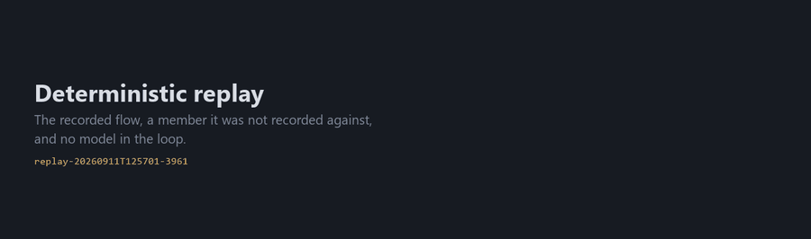
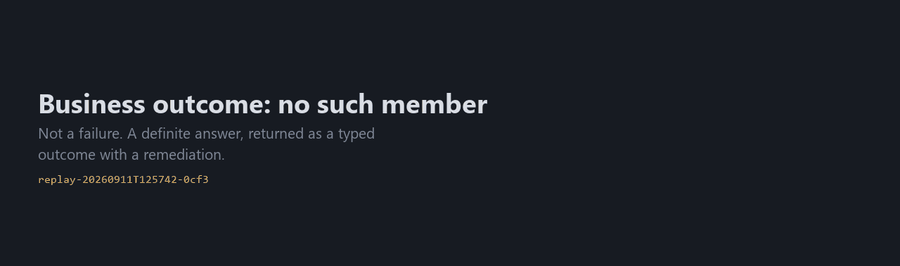
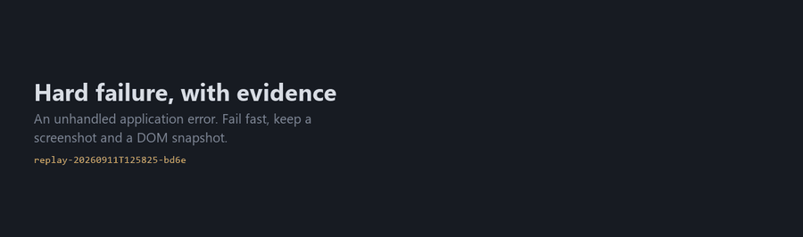
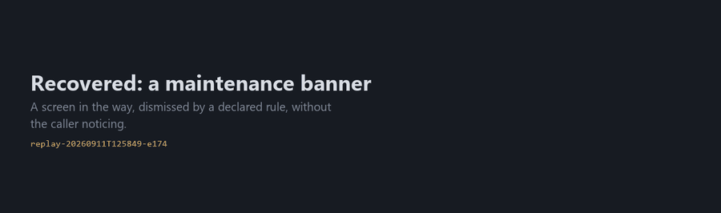
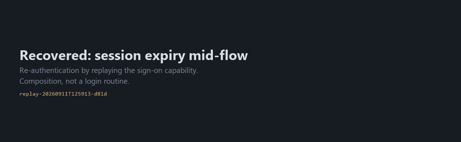
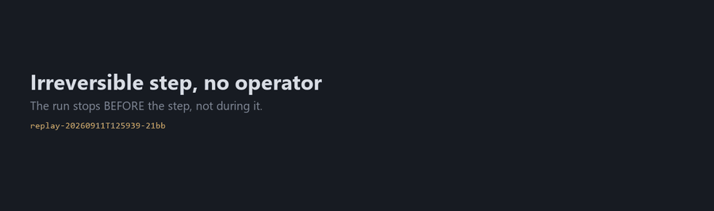
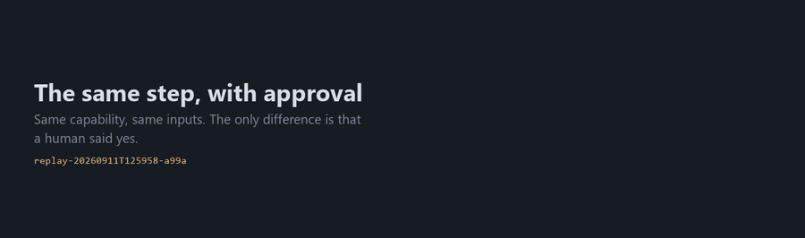
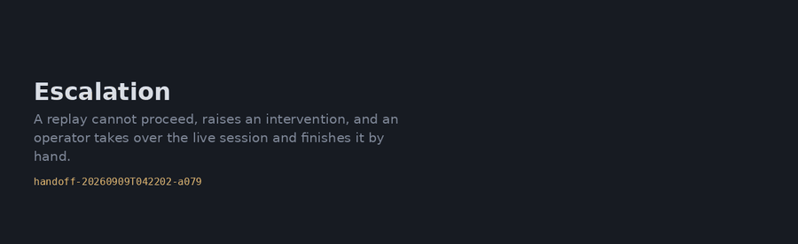

# Gallery

Every scenario the system handles, as a real run. Nothing here is staged: each
GIF is built from the annotated frames a run wrote to `evidence/` while it
happened, captioned with what that run recorded — the model's own rationale on a
discovery, the resolved locator and confidence on a replay.

Regenerate the whole set:

```bash
pcx target                             # terminal 1
python scripts/capture.py scenarios    # terminal 2 — runs each one and films it
```

**On the redaction.** The frames are evidence like any other, so values the
redactor would scrub out of a log are painted over in the picture too — you will
see `TAX ID (SSN)` and `DATE OF BIRTH` masked, with their captions left intact so
a reviewer can see what was removed. Member numbers, names and balances are *not*
masked: they are the thing the capability exists to return, and the artifacts
already contain none of them.

---

## Discovery — an LLM driving a live surface

The expensive half, and the only half that calls a model.

### The first capability: sign on


Every later run establishes its session by replaying this one, deterministically.
Capabilities compose from the first command.

### Look up a member and read a balance


Six turns. The caption under each frame is the model's own one-line rationale,
copied from `run.jsonl` — not a description written afterwards. The numbered
boxes are what it was addressing; it answers with `e9`, never with a selector.

---

## Replay — the same flow, no model

### Deterministic replay



A member it was *not* recorded against. `via label[0]` on every step means the
primary locator strategy resolved and nothing fell back. `llm calls: 0`.

---

## Outcomes — four endings that are not the same thing

Most automation has two states: it worked, or it threw. That is not enough to put
in front of a caller.

### No such member



`BUSINESS_OUTCOME / MEMBER_NOT_FOUND`. **Not a failure** — a definite, correct
answer to a lookup, returned as a typed contract value with a remediation.

### The record exists and this operator may not see it


`BUSINESS_OUTCOME / PERMISSION_DENIED`. Deliberately distinct from not-found:
one means "no such thing", the other means "it is there and not for you", and a
caller needs to do different things about them.

### A malformed input

There is **no GIF for this one, and that is the point.**

```
[replay] FAILED  outcome=INVALID_INPUT
  input 'member_number' does not match /\d{8}/
  hint    : Rejected at the contract boundary -- the application was never touched.
  llm calls: 0   degraded locators: 0   1 ms
```

One millisecond. No browser opened, so there are no frames to film. In a
regulated system the difference between "we rejected your input" and "we drove a
session into the core banking platform with your bad input" is the difference
between a log line and an incident.

### The application actually broke



`FAILED / APPLICATION_ERROR`. A real failure: fail fast, do not retry, and keep a
screenshot and a DOM snapshot for whoever has to work out why.

---

## Recovery — three things that kill a recorded macro

### A maintenance banner



A screen in the way, dismissed by a declared rule in the application profile.
The caller never learns it happened.

### A session that expires mid-flow



The longest run here, because it contains another one. Re-authentication is
performed by **replaying the sign-on capability** — composition, not a login
routine hard-coded into the engine. Then, because this flow is read-only, it
restarts from the top; a flow with side effects escalates instead, since
re-running half a transfer is not a recovery.

---

## Guardrails — the same step, twice

### Refused, with no operator available



`ESCALATED / APPROVAL_REQUIRED`. Read the hint in the last frame: *the run
stopped before the step, not during it.* It did not post and then ask.

### The same step, after a human said yes



Same capability, same inputs, same flow. The only difference is the approval.

---

## Escalation — a human on the live session



A replay hits something it cannot recover from. It does not guess and it does not
die: it raises an intervention and parks. What the operator gets is not a ticket,
it is **the live session** — same browser, mid-flow, state already built up. They
finish by hand and hand control back; the engine then re-evaluates the checkpoint
rather than assuming either outcome, and returns `OK_AFTER_HANDOFF`.

---

## Not filmed here

Two things need the whole desktop rather than the browser frame, so they are not
in the automatic set. Record them with:

```bash
pip install mss
python scripts/capture.py desktop --name crystallize -- python scripts/demo_crystallize.py
python scripts/capture.py desktop --name live-handoff -- python scripts/demo_live_handoff.py --simulated
```

| | why it needs the desktop |
|---|---|
| **Crystallization** — T3 → T2 → T1, a regression, recovery | It is entirely terminal output: gates passing and failing, a promotion, a circuit breaker. There is nothing in the browser to film. |
| **The live-site handoff** — ParaBank | The point is the operator console *beside* the live page it is driving. One window shows half the story. |

And the live-site runs themselves (`docs/LIVE_SITE_DEMO.md`) are not in this
gallery because they need credentials and a public host — `capture.py scenarios`
is deliberately local-only, so anyone can regenerate it from a clean clone with
nothing but the mock app.
